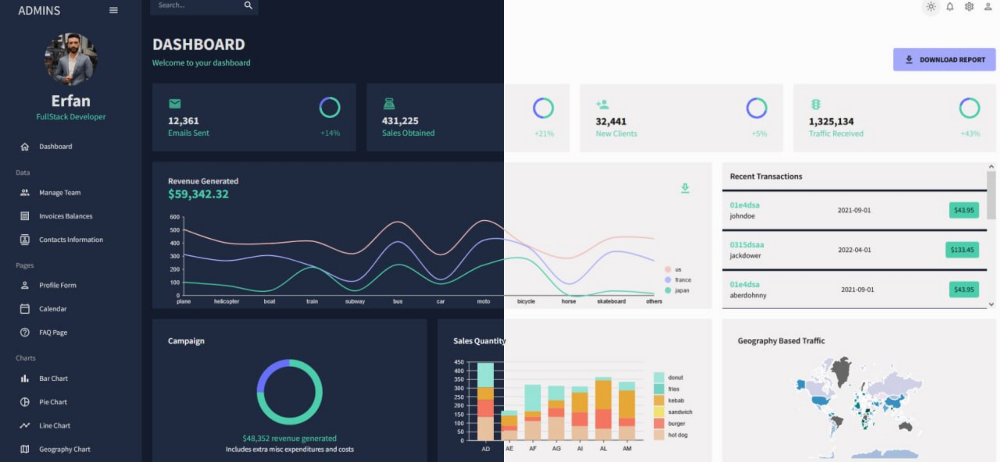

<div align="center">
  <br />
  
  <br />

  <div>
    
    
    
  </div>

  <h3 align="center">React Admin Dashboard – Built with MUI & React</h3>

  <div align="center">
    A modern, responsive admin dashboard built with React, Vite, and Material UI. <br />
  </div>
</div>

</br>
<div align="center">
  <a href="https://admin-dashboard-tau-one-70.vercel.app/" target="_blank">
    
  </a>
</div>


## 📋 Table of Contents

1. 🚀 [About](#about)
2. ⚙️ [Tech Stack](#tech-stack)
3. ✨ [Features](#features)
4. 🏁 [Quick Start](#quick-start)
5. 🤝 [Contributing](#contributing)
6. 📜 [License](#license)
7. 🔗 [Connect with Me](#connect-with-me)

## 🚀 About

**React Admin Dashboard** is a fully responsive, themeable admin panel built with Material-UI (MUI v5), React 18, and Vite.  
It includes dashboards, tables, forms, charts, and many reusable components — designed with scalability and performance in mind.

## ⚙️ Tech Stack

- **React 18**
- **Vite**
- **Material UI v5**
- **React Router v6**
- **Formik + Yup**
- **MUI DataGrid**
- **FullCalendar**
- **NivoCharts**

## ✨ Features

- 💡 Light & Dark Mode
- 📊 Data grids with filtering and pagination
- 📝 Form validation (Formik + Yup)
- 📈 Interactive charts and analytics
- 📅 Calendar integration
- 📱 Fully responsive design
- 🧱 Clean and modular component architecture

## 🏁 Quick Start

Clone the repository and install dependencies:

```bash
git clone https://github.com/erfansafarzad7/React-AdminDashboard-mui.git
cd React-AdminDashboard-mui
npm install
npm run dev
```

Visit [http://localhost:3000](http://localhost:5173) in your browser.


## 🤝 Contributing

Contributions are welcome! Please follow these steps:
1. Fork the repository.
2. Create a new branch.
3. Commit your changes.
4. Submit a pull request.

---

## 📜 License

This project is licensed under the MIT License. See the [LICENSE](LICENSE) file for details.

---

## 🔗 Connect with Me

- LinkedIn: [Visit Profile](https://linkedin.com/in/erfansafarzad7)
- Email: [Send Email](mailto:erfansafarzad7@gmail.com)
- Telegram: [Message Me](https://t.me/erfansafarzad7)

---

Happy Coding! 🎉
